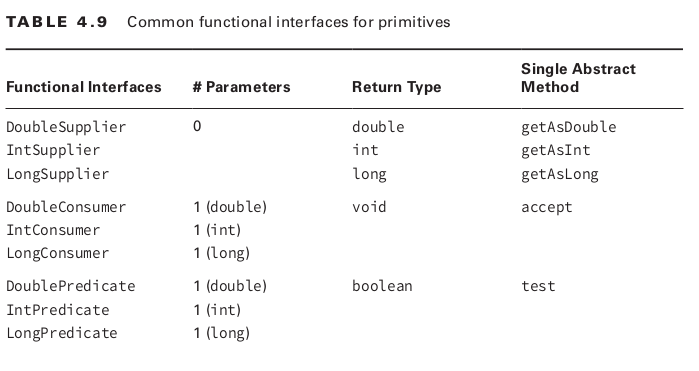
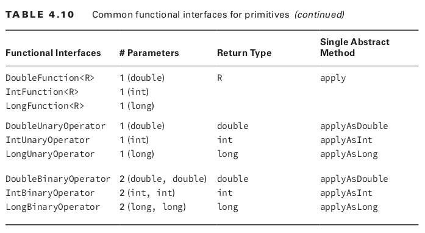
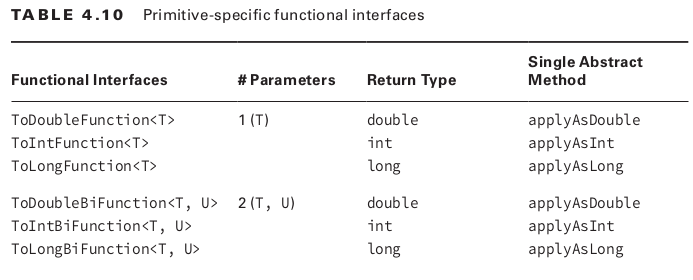
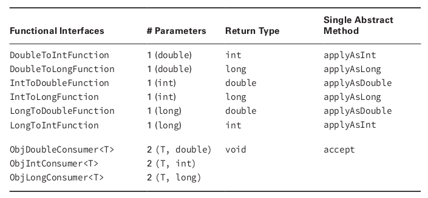

== Lambda

- Lambda expression can access static variables, instances variable, effectively final method params and local method variables.

|===
|Functional interfaces | Parameters | Return type | Single abstract method
| Supplier<T> | 0 | T | get
| Consumer<T> | 1 (T) | void | accept
| BiConsumer<T, U> | 2 (T, U) | void | accept
| Predicate<T> | 1 (T) | boolean | test
| BiPredicate<T, U> | 2 (T, U) | boolean | test
| Function<T, R> | 1 (T) | R | apply
| BiFunction<T, U, R> | 2 (T, U) | R | apply
| UnaryOperator<T> | 1 (T) | T | apply
| BinaryOperator<T> | 2 (T, T) | T | apply
|===

----
@FunctionalInterface public Supplier<T> {
    <T> get();
}

@FunctionalInterface public Consumer<T> {
    void accept(T t);
}

@FunctionalInterface public BiConsumer<T, U> {
    void accept(T t, U u);
}

@FunctionalInterface public Predicate<T> {
    boolean test(T t);
}

@FunctionalInterface public BiPredicate<T, U> {
    boolean test(T t, U u);
}

@FunctionalInterface public Function<T, R> {
    R apply(T t);
}

@FunctionalInterface public BiFunction<T, U, R> {
    R apply(T t, U u);
}

@FunctionalInterface public UnaryOperator<T> extends Function<T, T>{
}

@FunctionalInterface public BinaryOperator<T> extends BiFunction<T, T, T> {
}

----

Examples with `BiConsumer`
----
Map<String, Integer> map = new HashMap<>();
BiConsumer<String, Integer> b1 = map::put;
BiConsumer<String, Integer> b2 = (k, v) -> map.put(k, v);
----

Examples with `Predicate` and `BiPredicate`
----
Predicate<String> p1 = String::isEmpty;
Predicate<String> p2 = s -> s.isEmpty();

BiPredicate<String, String> bp1 = String::startsWith;
BiPredicate<String, String> bp2  = (string, prefix) -> string.startsWith(prefix);

Predicate<String> egg = s.contains("egg");
Predicate<String> brown = s.contains("brown");
Predicate<String> browEgg = egg.and(brown);
Predicate<String> otherEgg = egg.add(brow.negate());
----

Examples with `Function` and `BiFunction`
----
Function<String, Integer> f = String::length;
Function<String, Integer> f = s -> s.length();

BiFunction<String, String, String> b = String::concat;
BiFunction<String, String, String> b1 = (s, add) -> s.concat(add);
----

== Optional

|===
| Method | When Optional Is Empty | When Optional Contains a Value
| get() | Throws an exception | Returns value
| ifPresent(Consumer c) | Does nothing | Calls Consumer c with value
| isPresent() | Returns false | Returns true
| orElse(T other) | Returns other parameter | Returns value
| orElseGet(Supplier s) | Returns result of calling | Returns value
| orElseThrow(Supplier s) |Throws exception created by calling Supplier | Returns value
|===

== Stream
- stream is a sequence of data
- stream pipeline is the operations that run on stream to produce a result
- with streams, the data isn't generated up front, itis created when needed.
- a stream inclydes:
* source
* intermediate operations
* terminal operations

----
Stream<String> empty = Stream.empty();
Stream<Integer> singleElemnt = Stream.of(1);
Stream<Inteteger> fromArray = Stream.of(1,2,3);
List<String> list = Arrays.asList("1", "2", "3");
Stream<String> fromList = list.stream();
Stream<String> fromListParallel = list.parallelStream();
Stream<Double> randoms = Stream.generate(Math::random);
Stream<Integer> oddNumbers = Stream.iterate(1, n -> n + 2);
----

- terminal stream operations

- `allMatch(), anyMatch(), noneMatch()`
- `collect()`
- `count()`
- `findAny(), findFirst()` -> Optional<T>
- `forEach()`
- `Optional<T> min(<? super T> comparator)`
- `Optional<T> max(<? super T> comparator)`
- `reduce()`

----
Stream<String> s = Stream.of("1", "2", "3");
System.out.println(s.count()); // 3

Optional<?> minEmpty = Stream.empty().min((s1, s2) -> 0);
System.out.println(minEmpty.isPresent()); // false

Stream<String> s = Stream.of("1", "2", "3");
Stream<String> infinite = Stream.generate(() -> "4");
s.findAny().ifPresent(System.out::println); // 1
inifnite.findAny().ifPresent(System.out::println); // 4

List<String> list = Arrays.asList("1", "2", "a");
Stream<String> infinite = Stream.generate(() -> "4");
Predicate<String> pred = x -> Character.isDigit(x.charAt(0), 10);
System.out.println(list.stream().allMatch(pred)); // false
System.out.println(list.stream().anyMatch(pred)); // true
System.out.println(list.stream().noneMatch(pred)); // false
System.out.println(infinite.anyMatch(pred)); // true
----

=== reduce()
----
Stream<String> s = Stream.of("1", "2", "3", "4");
System.out.println(s.reduce("", (a,b) -> a + b)); // 1234
s = Stream.of("3", "4", "5", "6");
System.out.println(s.reduce("", String::concat)); // 3456
----

- reduce with three params, used in parallel stream

----
<U> U reduce(U identity, BiFunction<U,? super T,U> accumulator, BinaryOperator<U> combiner);

BinaryOperator<Integer> op = (a, b) -> a * b;
System.out.println(stream.reduce(1, op, op));
----

=== collect()

----
<R> R collect(Supplier<R> supplier, BiConsumer<R, ? super T> accumulator BiConsumer<R, R> combiner);
<R,A> R collect(Collector<? super T, A,R> collector);
----

- examples
----
Stream<String> stream = Stream.of("1", "2", "3", "4");
StringBuilder word = stream.collect(StringBuilder::new, StringBuilder::append, StringBuilder::append);
System.out.println(word.toString()); // 1234
----

----
Stream<String> stream = Stream.of("1", "2", "3", "4");
TreeSet<String> set = stream.collect(TreeSet::new, TreeSet::add, TreeSet::addAll);
System.out.println(set); // [1, 2, 3, 4]
set = stream.collect(Collections.toCollection(TreeSet::new));
set = stream.collect(Collections.toSet());
----

NOTE: should not rely on `Collections.toSet` as it's not cleared which implementation of Set will be used.

== Intermediate operations
- filter()
- distinct()
- limit()
- skip()
- map()

[source,java]
----
Stream<String> s = Stream.of("1", "2", "3");
s.map(String::length).forEach(System.out::print);
----

- flatMap(): useful to flatten list of lists
[source,java]
----
List<String> zero = Arrays.asList();
List<String> one = Arrays.asList("one");
List<String> two = Arrays.asList("one", "two");

Stream<List<String>> animals = Stream.of(zero, one, two);
animals.flatMap(l -> l.stream()).forEach(System.out::println);
----

- sorted()
- peek(): output the content of the Stream as it goes by, it allow us to perform a stream operation without actually changing the stream.

== Working with primitives
- IntStream: int, short, byte, char
- DoubleStream: double, float
- LongStream: long

[source,java]
----
IntStream intStream = IntStream.of(1,2,3);
OptionalDouble avg = intStream.average();
avg.getAsDouble();

DoubleStream random = DoubleStream.generate(Math::random);
DoubleStream fractions = DoubleStream.iterate(.5, d -> d / 2);

IntStream count = IntStream.iterate(1, n -> n + 1).limit(5);
IntStream range = IntStream.range(1, 6);
IntStream rangeClosed = IntStream.rangeClosed(1, 5);
----

- Stream map to itself: map
- Stream map to primitve stream: mapToInt, mapToDouble, mapToLong
- primitive stream map to stream: mapToObj

- IntFunction/ToIntFunction, DoubleFunction/ToDoubleFunctio, LongFunction/ToLongFunction
- Function, IntUnaryOperator, DoubleUnaryOperator, LongUnaryOperator
- DoubleToLongFunction, DoubleToIntFunction
- IntToDoubleFunction, IntToLongFunction
- LongToDoubleFunction, LongToIntFunction

- flatMapToInt(), flatMapToLong(), flatMapToDouble()

- Optional<Doube> is for Double object, OptionalDouble is for pirimitve double.

- getAsDouble(), orElseGet(), max(), min(), avg()

- DoubleSummaryStatistics stats = doubles.summaryStatistics();

=== BooleanSupplier
This is the only functional interface for boolean.

[source,java]
----
BooleanSupplier b1 = () -> true;
System.out.println(b1.getAsBoolean());
----

These functional interfaces are for primitives

- DoubleSupplier, IntSupplier, LongSupplier
- DoubleConsumer, IntConsumer, LongConsumer
- DoublePredicate, IntPredicate, LongPredicate

- DoubleFunction, IntFunction, LongFunction
- DoubleUnaryOperator, IntUnaryOperator, LongUnaryOperator
- DoubleBinaryOperator, IntBinaryOperator, LongBinaryOperator

- ObjDoubleConsumer<T>
- ObjIntConsumer<T>
- ObjLongConsumer<T>

=== Stream with underlying data
- Streams are lazily created

[source,java]
----
List<String> cats = new ArrayList<>();
cats.add("Annie");
cats.add("Ripley");
Stream<String> stream = cats.stream();
cats.add("KC");
System.out.println(stream.count()); // 3
----

=== Chaining Optionals
A few of the intermediate operations for streams are available for Optional

[source,java]
----
private static void threeDigit(Optional<Integer> optional) {
optional.map(n -> "" + n)
        // part 1
        .filter(s -> s.length() == 3)
        // part 2
        .ifPresent(System.out::println);
        // part 3
}
----

=== Collectiong to Map
[source,java]
----
Stream<String> ohMy = Stream.of("lions", "tigers", "bears");
Map<String, Integer> map = ohMy.collect(
Collectors.toMap(s -> s, String::length));
System.out.println(map); // {lions=5, bears=5, tigers=6}
----

This will give an exception at runtime because we didn't specify what happens when two keys are the same.
[source,java]
----
Stream<String> ohMy = Stream.of("lions", "tigers", "bears");
Map<Integer, String> map = ohMy.collect(Collectors.toMap(String::length, k ->
k)); // BAD
----

[source,java]
----
Stream<String> s = Stream.of("lions", "tigers", "bears");
Map<Integer, String> map = s.collect(Collectors.toMap(String::length, k -> k, (s1, s2) -> s1 +","+s2));
System.out.println(map); // {5=lions,bears, 6=tigers}
System.out.println(map.getClass()); // class. java.util.HashMap
map = s.collect(Collectors.toMap(String::length, k->k, (s1, s2) -> s1 + "," + s2), TreeMap::new);
System.out.println(map); // // {5=lions,bears, 6=tigers}
System.out.println(map.getClass()); // class. java.util.TreeMap
----

=== Grouping, Partitioning, Mapping
- groupingBy()
[source,java]
----
Stream<String> s = Stream.of("lions", "tigers", "bears");
Map<Integer, List<String>> map = s.collect(Collectors.groupingBy(String::length));
System.out.println(map); // {5=[lions, bears], 6=[tigers]}
----

We can tell how to group the value together, like into a Set

[source,java]
----
Stream<String> s = Stream.of("lions", "tigers", "bears");
Map<Integer, Set<String>> map = s.collect(Collectors.groupingBy(String::length, Collectors.toSet()));
System.out.println(map); // {5=[lions, bears], 6=[tigers]}
----

We can even change the type of Map
[source, java]
----
Stream<String> s = Stream.of("lions", "tigers", "bears");
TreeMap<Integer, Set<String>> map = s.collect(Collectors.groupingBy(String::new, TreeMap::new, Collectors.toSet()));
System.out.println(map); // {5=[lions, bears], 6=[tigers]}
----

Partitioning is a special case of grouping, it only groups into two part, true and false.

[source,java]
----
Stream<String> s = Stream.of("lions", "tigers", "bears");
Map<Boolean, List<String>> map = s.collect(Collectors.partitioningBy(s -> s.length() <= 5));
System.out.println(map); // {false=[tigers], true=[lions, bears]}
----

[source,java]
----
Stream<String> ohMy = Stream.of("lions", "tigers", "bears");
Map<Boolean, Set<String>> map = ohMy.collect(Collectors.partitioningBy(s -> s.length() <= 7, Collectors.toSet()));
System.out.println(map);// {false=[], true=[lions, tigers, bears]}
----

Unlike groupingBy() , we cannot change the type of Map that gets returned. However, there are only two keys in the map, so does it really matter which Map type we use.
[source,java]
----
Stream<String> ohMy = Stream.of("lions", "tigers", "bears");
Map<Integer, Long> map = ohMy.collect(Collectors.groupingBy(String::length, Collectors.counting()));
System.out.println(map); // {5=2, 6=1}
----

- mapping() collectors let us go down one level and add another collector.
[source,java]
----
Map<Integer, Optional<Character>> map = ohMy.collect(
Collectors.groupingBy(String::length, 
    Collectors.mapping(s -> s.charAt(0),
        Collectors.minBy(Comparator.naturalOrder()))));
System.out.println(map); // {5=Optional[b], 6=Optional[t]}
----

NOTE: collect(), count(), max(), min(), reduce() are reductions.

NOTE: flatMap() flattens nested lists into a single level and remove empty lists.

WARNING: all code that use method reference can be rewritten using lambda, but not vice versa.

NOTE: Stream objects can be used only once. Once the Stream pipeline is run, the Stream is marked invalid.

